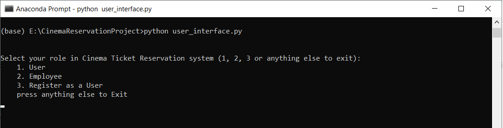
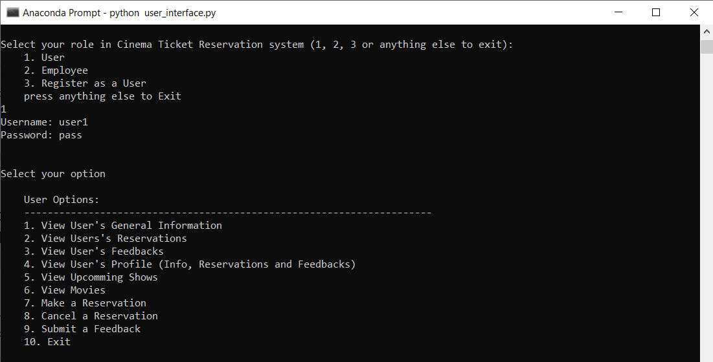
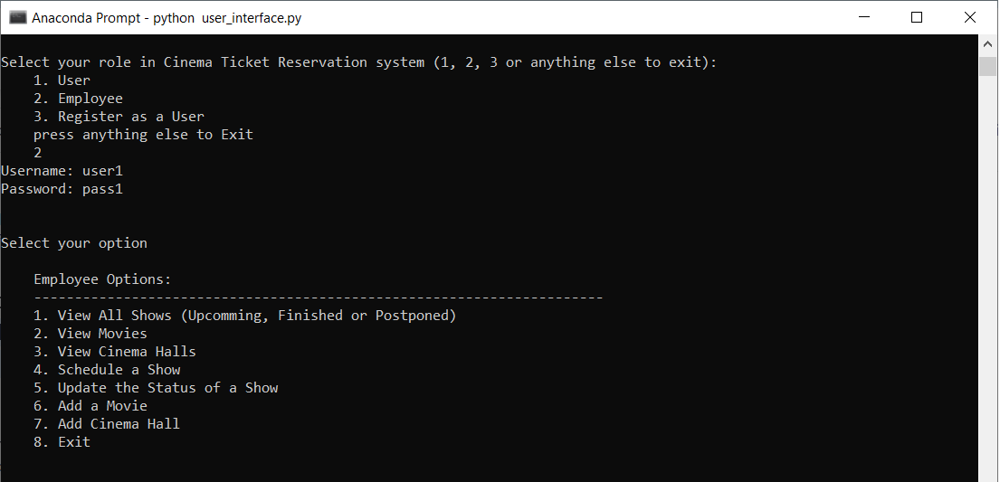

# Cinema Reservation Sytem

## Description
This project is a Python course assignment focused on Object-Oriented Programming (OOP). As databases are not utilized in this project, the decision was made to store and manage data using JSON files. To facilitate this, a class called `File` has been implemented to handle interactions with the JSON files. While this approach may seem unconventional, the intention is to enhance the realism of the project, as data persistence is a crucial aspect in real-world applications.

## Setup
- Ensure Python 3.8 or higher is installed on your system.


## Usage

- Please ensure that all JSON files containing either no data or incomplete data are placed in the appropriate directory.
- Make sure to provide a valid API key in the configuration file. 
- To execute the `user_interface.py` script, use Python and follow the provided options.


```bash
python user_interface.py
```

## Data

To store data related to entities such as User, Employee, Show, Reservation, Movie, Feedback and CinemaHall, please ensure that there is an associated JSON file for each entity. The JSON file should be named accordingly, for example: users.json, employees.json, etc.
To locate the data JSON files, please navigate to the directory specified under the section `DATA_DIRECTORY` in the config file. By default, the directory is set to `./data/`. However, you have the flexibility to modify this to your preferred directory.
Currently, I have included some data in each JSON file. However, you have the option to remove this information and replace it with an empty data JSON file that follows the following format:

```json
   {
     "id_count": 1111,
     "data": {

     }
   }
```

## Configuration file:
The `config.ini` file should be placed alongside the other .py files and should follow the specified format:
```python
[Movie]
API_KEY = 3de7426f8sf56jw376aa564f7c544
[Directory]
DATA_DIRECTORY = ./data/

```
In this file, the `API_KEY` represents the key required to establish a connection with `The Movie Database (TMDB)` API. Please make sure to provide a valid API key to avoid any errors related to the usage of the `Add Movie` option within the `Employee` section. 
We previously discussed the utilization of the `DATA_DIRECTORY` section in the `Data` part of this Readme.

## Demo:
When executing the `user_interface.py` script, the following command line will be displayed: 


*the Main Interface*

Depending on the option you choose (1, 2, or 3), the corresponding menu will be shown. If you are a user who already has a username and password, select option 1 to log in and access the following User Options: 


*the User Options*

If you are an Employee, please note that you cannot register as an employee using this system. Employees are registered by the admin and provided with their respective username and password. After logging in as an Employee, you will be presented with the following options. Simply select your desired option and enjoy using the program!


*the Employee Options*


---

Thank you for taking the time to explore our project on GitHub. Your interest and support are greatly appreciated.